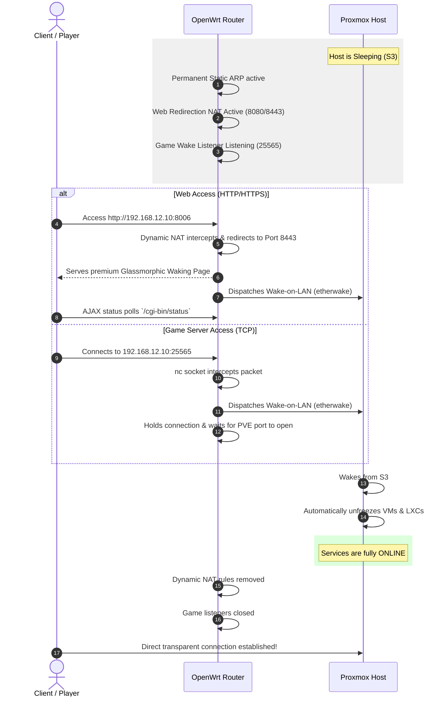

# 🔋 Homelab Power-Saving & Idle Orchestration Suite

A highly optimized, POSIX-native, zero-cloud-dependent idle orchestration and power-saving suite designed for **Proxmox VE** hosts and **OpenWrt** routers. 

This suite enables aggressive power-saving (ACPI S3 Suspend-to-RAM) on high-power homelab servers when they are idle, while maintaining seamless, transparent network accessibility for web applications and game servers using Wake-on-Demand proxies.

---

## 🗺️ Architectural Workflow



---

## 📂 Suite Directory Structure

The suite is modularized into two distinct control zones:

```text
PowerOrchestrator/
├── README.md                           # This documentation
├── proxmox/                            # Proxmox VE Host Management
│   ├── homelab_power.conf              # PVE idle detection configuration
│   ├── proxmox_idle_monitor.sh         # Core idle monitor & guest suspender
│   ├── proxmox_idle_monitor.service     # Systemd service wrapper
│   ├── proxmox_idle_monitor.timer       # Systemd timer (10 min schedule)
│   └── install_proxmox.sh              # PVE automated installer
└── openwrt/                            # OpenWrt Router Control Plane
    ├── homelab_power.conf              # Bot tokens, IPs, MACs, & redirection ports
    ├── telegram_bot_daemon.sh          # POSIX shell long-polling Bot
    ├── telegram_bot.init               # OpenWrt procd Telegram init service
    ├── power_proxy_daemon.sh           # Dynamic firewall, ARP, & state machine
    ├── power_proxy.init                # OpenWrt procd Power Proxy init service
    ├── game_wake_listener.sh           # TCP socket wake-on-demand handler
    ├── install_openwrt.sh              # OpenWrt automated installer
    └── waking_server/                  # uhttpd Landing Page Root
        ├── index.html                  # Premium HTML5/CSS3 glassmorphic UI
        └── cgi-bin/
            └── status                  # CGI WOL dispatch & status endpoint
```

---

## ⚡ Setup & Deployment Instructions

### 🔑 Phase 1: Establish Secure SSH Key Trust
The OpenWrt router needs passwordless access to the Proxmox VE host to safely execute container and VM suspensions.

1. **SSH into your OpenWrt router**:
   ```bash
   ssh root@192.168.12.1
   ```
2. **Generate a Dropbear SSH key**:
   ```bash
   dropbearkey -t rsa -f /etc/dropbear/id_dropbear
   ```
3. **Extract the public key**:
   ```bash
   dropbearkey -y -f /etc/dropbear/id_dropbear | head -n 2 | tail -n 1 > /tmp/id_dropbear.pub
   ```
4. **Append the public key to Proxmox's authorized keys**:
   Copy the contents of `/tmp/id_dropbear.pub` and append it to `/root/.ssh/authorized_keys` on your Proxmox host.
5. **Test SSH connection from OpenWrt to Proxmox**:
   ```bash
   ssh -i /etc/dropbear/id_dropbear root@192.168.12.10 "pvesh get /cluster/resources"
   ```
   *(Ensure it connects instantly without prompting for a password!)*

---

### 🖥️ Phase 2: Deploy to Proxmox VE Host

1. **Transfer the Proxmox files**:
   Transfer the `proxmox/` directory of this suite to your Proxmox host (e.g., via SCP):
   ```bash
   scp -r PowerOrchestrator/proxmox root@192.168.11.10:/tmp/proxmox_install
   ```
2. **Run the Installer**:
   SSH into the Proxmox host and execute the installer:
   ```bash
   cd /tmp/proxmox_install
   bash install_proxmox.sh
   ```
   > [!TIP]
   > If you customized your `homelab_power.conf` locally on your laptop first, run the installer with the `--force` or `-f` flag to overwrite the active configuration on the host:
   > ```bash
   > bash install_proxmox.sh --force
   > ```
3. **Configure thresholds**:
   Edit the configuration file to tailor idle load limits, monitored ports, and network interfaces:
   ```bash
   nano /etc/homelab_power.conf
   ```
   - **`NET_INTERFACE` / `NET_THRESHOLD_KBPS`**: Set this to monitor average network speed over a 10-second window. Idle hosts will bypass CPU load checks if network throughput remains below the threshold (ideal for high background container density!).
4. **Test the configuration manually**:
   You can run a dry-run or force the idle service to execute:
   ```bash
   systemctl start proxmox_idle_monitor.service
   ```
   *Observe the logs using:* `tail -f /var/log/proxmox_power.log`

---

### 📶 Phase 3: Deploy to OpenWrt Router (Supports 23.05+ and 24.x APK)

1. **Transfer the OpenWrt files**:
   Transfer the `openwrt/` directory to the router's `/tmp` directory:
   ```bash
   scp -O -r PowerOrchestrator/openwrt/ root@192.168.11.1:/tmp/openwrt_install
   ```
2. **Execute the Installer**:
   SSH into the OpenWrt router and run the installer:
   ```bash
   cd /tmp/openwrt_install
   sh install_openwrt.sh
   ```
   > [!NOTE]
   > The installer detects if you are running modern **OpenWrt 24+** (using the `apk` Alpine package manager) or older branches (using `opkg`) and automatically manages updates and installations natively!
   > 
   > Add the `--force` or `-f` flag if you want to push configurations edited on your laptop directly:
   > ```bash
   > sh install_openwrt.sh --force
   > ```
3. **Configure Bot Credentials & IPs**:
   Open `/etc/homelab_power.conf` and populate it with your Telegram details:
   ```bash
   nano /etc/homelab_power.conf
   ```
   Ensure you set:
   * `BOT_TOKEN`
   * `ALLOWED_USER_IDS`
   * `HOST_IP` (e.g., `192.168.11.10`)
   * `HOST_MAC` (The actual physical MAC address of Proxmox NIC)
   * `GAME_REDIRECT_PORTS` (Supports protocol suffix, e.g. `25565,19132/udp,27015/udp,27016/udp` for Minecraft Java/Bedrock and Unturned Steam query/game ports).
4. **Restart Daemon Services**:
   Restart the services to load the new credentials:
   ```bash
   /etc/init.d/power_proxy restart
   /etc/init.d/telegram_bot restart
   ```

---

## 🚀 Phase 4: Multi-Guest Dynamic Auto-Sleep & Auto-Wake Orchestrator

If you want to run multiple heavy services but dynamically reclaim their memory and CPU cores when not in use:

1. **Configure your guest maps** in `/etc/homelab_power.conf` on **both** Proxmox and OpenWrt:
   ```ini
   # Format: "VMID:IP_ADDRESS:PORT/PROTOCOL:IDLE_MINUTES"
   # PROTOCOL can be 'tcp' or 'udp'
   GUEST_ORCHESTRATION_MAP="101:192.168.11.50:25565/tcp:15,102:192.168.11.60:19132/udp:15"
   ```
2. **Push the configurations** with the `--force` flag on both hosts to apply the update.
3. **Dynamic Operation**:
   - **Auto-Suspend**: If a guest (e.g. VM `101`) has 0 active clients on its port for 15 minutes, Proxmox suspends it, returning **100% of its RAM and CPU cores** back to the resource pool!
   - **Auto-Wake on Demand**: When a client connects to the guest's IP (`192.168.11.50`), your OpenWrt router intercepts the connection attempt, sends a secure Dropbear SSH command to Proxmox (`qm resume 101`), and restores the VM instantly. The client connects transparently!

---

---

## 🎨 Phase 5: Unified Glassmorphic Portal Dashboard & Optional Passcodes

The landing page features a **dual-mode engine** that adapts dynamically depending on how it is accessed:

### A. Unified Directory Mode (No parameters, e.g. `http://your-router.ts.net:8080/`)
When accessed without any query string, it serves a gorgeous, unified glassmorphic portal of all authorized guest servers.
* **Portal-Level Gatekeeper**: Secures your dashboard from unauthorized eyes. Configure `PORTAL_FUNNEL_PASSCODE` (for friends/public access) and `PORTAL_PRIVATE_PASSCODE` (for private/LAN access) in `/etc/homelab_power.conf` to lock the portal.
* **Interactive Live Grid**: Displays status cards (ONLINE, SLEEPING, or WAKING) for every guest.
* **Instant Search/Filter**: A smooth, interactive input bar to filter cards in real-time.
* **One-Click Secure Wakes**: Click "Wake" to boot any guest. If a passcode is configured in `GUEST_PASSCODE_MAP`, it opens a passcode verification modal. If no passcode is configured, it **bypasses verification entirely** and boots instantly!
* **Auto-Redirect Web UIs**: For web interfaces (like NAS or Home Assistant), the portal will automatically redirect the user's browser tab to their web interface as soon as the service finishes booting!

### B. Single-Service Mode (Tailored URL, e.g. `http://your-router.ts.net:8080/?service=minecraft`)
Perfect for directing friends directly to a single game server without exposing other homelab details.
* Customizes titles and instructions dynamically.
* Verified passcodes are saved in `localStorage` under service-specific isolated keys (e.g. `wake_code_120`), ensuring they never conflict.

---

## 🔒 Advanced Security, Privacy & Anti-DDoS

### 1. Privacy Isolation (Private vs. Public)
Hide sensitive private UIs (like your Home Assistant or NAS) from gaming friends!
* Define your trusted LAN/Tailscale subnets in `PRIVATE_SUBNETS="192.168.11.0/24,100.64.0.0/10"`.
* Mapped VMIDs in `GUEST_PRIVACY_MAP="120:public,121:private"` are evaluated against the client's source IP (`$REMOTE_ADDR`).
* Trusted IPs see **all services**; external visitors (friends/public funnel) see **only public services** (private ones are completely hidden from the grid).
* Message descriptions and passwords (from `GUEST_MESSAGE_MAP`) are strictly omitted from JSON payloads until the correct passcode is successfully entered.

### 2. Native DDoS Guard & Cooldown Block
Exposing status queries to the public via Tailscale Funnel poses trigger spam risks. The router implements a dual-layer defender:
* **IP Rate Limiting**: Client IP requests are tracked in RAM-based filesystem `/tmp/status_rate_limit/`. If a client spams the status queries (exceeding 1 query per 3 seconds), they are instantly blocked with a lightweight JSON warning.
* **WoL Cooldown Lock**: A global `/tmp/wol_cooldown_lock` enforces a **60-second cooldown** between Wake-on-LAN and guest start SSH dispatches, completely blocking spam at the core and safeguarding your hardware.

### 3. UDP Connection Tracking on Proxmox
Monitored ports now support protocol suffixes (e.g. `MONITORED_PORTS="22,25565/tcp,19132/udp"`). The idle script queries kernel `conntrack` (with native `ss` fallback) to monitor active UDP gaming streams (like Minecraft Bedrock, Valheim, or Unturned), preventing premature host suspension during live sessions.

---

---

## 🛠️ Verification & Operations Guide

### How to verify ACPI S3 capability on Proxmox:
Before trusting the script, verify that your server is capable of waking up successfully from S3 Suspend:
```bash
# Sleep for 30 seconds and wake up automatically
rtcwake -m mem -s 30
```
If the host successfully sleeps and resumes keyboard, network, and disk states after 30 seconds, your hardware supports S3 flawlessly!

### 🤖 Telegram Bot Control & Commands

Once active, search for your bot in Telegram and start interacting.

#### Available Commands:
* **⚡ Host Power Control**:
  * `/status` - Check host power (ONLINE/OFFLINE), PVE resource status (CPU Load, RAM Usage), and guest counts.
  * `/wake` - Forcefully wake the Proxmox host using Wake-on-LAN (Magic Packet).
  * `/sleep` - Safely suspend guest nodes and sleep the host (checks for idle criteria).
  * `/sleepforce` - Immediately suspend guest nodes and sleep the host (bypasses idle criteria).
  * `/hostshutdown` - Safely shutdown the Proxmox host completely (blocks if non-exempt guests are running).
  * `/hostshutdownforce` - Immediately stop/suspend guest nodes and shut down the host.
  * `/hostreboot` - Safely reboot the Proxmox host (blocks if non-exempt guests are running).
  * `/hostrebootforce` - Immediately stop/suspend guest nodes and reboot the host.
* **🖥️ Guest Node Control**:
  * `/list` - List all LXC containers and QEMU VMs with their status (running/stopped).
  * `/ctstart <vmid>` - Wakes the Proxmox host if sleeping and starts the specific VM or container.
  * `/ctstop <vmid>` - Performs a clean shutdown/stop of the specific VM or container.
  * `/ctrestart <vmid>` - Restarts the specific VM or container.

> [!IMPORTANT]
> **Manual vs. Automated Sleep/Shutdown Design:**
> * **Automated (Idle Checks):** The background cron job running on Proxmox evaluates `proxmox_idle_monitor.sh` continuously. It **will block** sleep if an orchestrated container is in its countdown, if CPU/network activity is high, or if you have open active SSH sessions (port 22) or Web UI sessions (port 8006).
> * **Manual Safe Actions:** `/sleep`, `/hostshutdown`, and `/hostreboot` verify safety criteria (such as blocking if active non-exempt guest nodes are running) before triggering.
> * **Manual Forced Actions:** Commands ending in `force` (like `/sleepforce`, `/hostshutdownforce`, `/hostrebootforce`) **bypass all safety/idle criteria** to immediately suspends/stop guests and trigger the power state changes.

#### ⚙️ Registering Commands with BotFather:
To enable the auto-completion menu for commands in Telegram:
1. Message **[@BotFather](https://t.me/BotFather)** on Telegram.
2. Send `/setcommands` and choose your Homelab Bot.
3. Paste the following block exactly:
   ```text
   status - Check host power and PVE resource status
   wake - Wake the Proxmox host (Wake-on-LAN)
   sleep - Safely sleep host (respects idle rules)
   sleepforce - Force host to sleep immediately
   hostshutdown - Safe graceful shutdown
   hostshutdownforce - Force shutdown immediately
   hostreboot - Safe reboot
   hostrebootforce - Force reboot immediately
   list - List all LXC containers and VMs
   ctstart - Start a specific VM/container (e.g. /ctstart 101)
   ctstop - Stop a specific VM/container (e.g. /ctstop 101)
   ctrestart - Restart a specific VM/container (e.g. /ctrestart 101)
   ```

---

## 🔒 Security Protocols & Best Practices

1. **Strict Admin Verification**:
   The Telegram daemon cross-references every single update's sender ID with the `ALLOWED_USER_IDS` in `/etc/homelab_power.conf`. Requests from unauthorized users are immediately dropped and reported to the main administrator.
2. **Local SSH Sandboxing**:
   Ensure `/etc/dropbear/id_dropbear` on the router has restricted permissions (`chmod 600`). Since Dropbear keys do not support passphrase protection natively, ensure physical security of the router backup files.
3. **No External Ingress exposure**:
   Because your router is under CGNAT, there are no open WAN ports. The Telegram daemon operates on **pure long-polling outbound sockets** to `api.telegram.org` and does not accept inbound WAN traffic, completely closing the host to external port scans.
