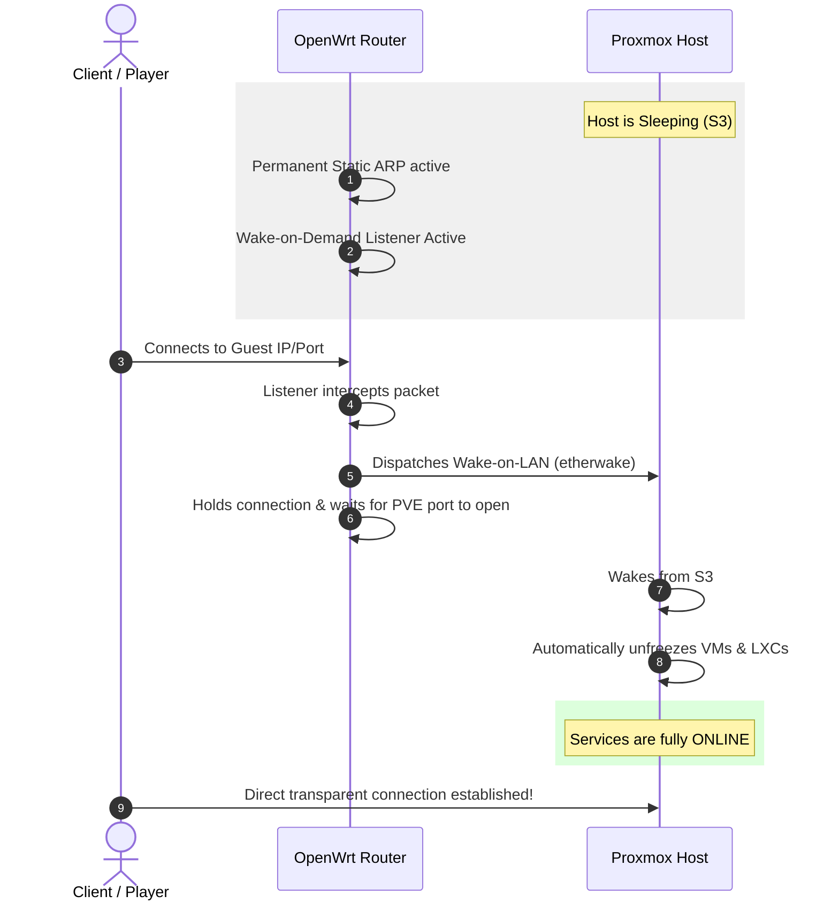

# Homelab Power-Saving and Idle Orchestration Suite

A highly optimized, POSIX-native, zero-cloud-dependent idle orchestration and power-saving suite designed for **Proxmox VE** hosts and **OpenWrt** routers. 

This suite enables aggressive power-saving (ACPI S3 Suspend-to-RAM) on high-power homelab servers when they are idle, while maintaining seamless, transparent network accessibility for web applications and game servers using Wake-on-Demand proxies.

---

## Architectural Workflow


```mermaid
sequenceDiagram
    autonumber
    actor Client as Client / Player
    participant OpenWrt as OpenWrt Router
    participant PVE as Proxmox Host
    
    rect rgb(240, 240, 240)
        note over PVE: Host is Sleeping (S3)
        OpenWrt->>OpenWrt: Permanent Static ARP active
        OpenWrt->>OpenWrt: Wake-on-Demand Listener Active
    end

    Client->>OpenWrt: Connects to Guest IP/Port
    OpenWrt->>OpenWrt: Listener intercepts packet
    OpenWrt->>PVE: Dispatches Wake-on-LAN (etherwake)
    OpenWrt->>OpenWrt: Holds connection & waits for PVE port to open

    PVE->>PVE: Wakes from S3
    PVE->>PVE: Automatically unfreezes VMs & LXCs
    
    rect rgb(220, 255, 220)
        note over PVE: Services are fully ONLINE
    end

    Client->>PVE: Direct transparent connection established!
```

---

## Suite Directory Structure

The suite is modularized into two distinct control zones:

```text
PowerOrchestrator/
├── README.md                               # This documentation
├── proxmox/                                # Proxmox VE Host Management
│   ├── proxmox_idle_monitor.sh             # Core idle monitor & guest suspender
│   ├── proxmox_idle_monitor.(service|timer) # Systemd service + 10-min timer
│   ├── proxmox_resource_monitor.sh         # Host/guest resource usage monitor
│   ├── proxmox_resource_monitor.(service|timer)
│   ├── homelab_ssh_wrapper.sh              # Secure SSH command restrictions wrapper
│   └── install_proxmox.sh                  # PVE automated installer
└── openwrt/                                # OpenWrt Router Control Plane
    ├── power_homelab.conf(.example)        # Router/proxy/telegram configuration
    ├── messages_homelab.conf               # Discord/telegram notification messages
    ├── components/                         # Shared helpers (check, common_init, conf)
    ├── config_sync/                        # homelab_config_sync.sh + deploy/verify helpers
    ├── install/                            # Automated installer + components/
    ├── power_proxy/                        # Wake-on-Demand proxies + components/
    └── telegram/                           # Telegram daemon, commands/, and helpers
```

---

## Setup and Deployment Instructions

### Phase 1: Establish Secure SSH Key Trust
The OpenWrt router needs passwordless access to the Proxmox VE host to safely execute container and VM suspensions.

1. **SSH into your OpenWrt router**:
   ```bash
   ssh root@192.168.12.1
   ```
2. **Generate a Dropbear SSH key**:
   ```bash
   dropbearkey -t rsa -f /etc/dropbear/id_dropbear
   ```
3. **Extract the public key**:
   ```bash
   dropbearkey -y -f /etc/dropbear/id_dropbear | head -n 2 | tail -n 1 > /tmp/id_dropbear.pub
   ```
4. **Append and Restrict the Public Key on Proxmox**:
   Copy the contents of `/tmp/id_dropbear.pub` and add it to authorized_keys on your Proxmox host.
   
   > [!IMPORTANT]
   > **Secure and Restrict SSH Access!**
   > To prevent arbitrary command execution, restrict this key to only running our orchestrator commands by prepending the command wrapper.
   >
   > **For root user (`/root/.ssh/authorized_keys`):**
   > ```text
   > command="/usr/local/bin/homelab_ssh_wrapper.sh",no-port-forwarding,no-x11-forwarding,no-agent-forwarding ssh-ed25519 AAAAC3NzaC1... (your Dropbear key)
   > ```
   >
   > **For non-root user (e.g. `/home/adminuser/.ssh/authorized_keys`):**
   > ```text
   > command="sudo /usr/local/bin/homelab_ssh_wrapper.sh",no-port-forwarding,no-x11-forwarding,no-agent-forwarding ssh-ed25519 AAAAC3NzaC1... (your Dropbear key)
   > ```
   > And add to `/etc/sudoers.d/homelab_power` on Proxmox:
   > ```text
   > Defaults:adminuser env_keep += "SSH_ORIGINAL_COMMAND"
   > adminuser ALL=(root) NOPASSWD: /usr/local/bin/homelab_ssh_wrapper.sh
   > ```

5. **Test SSH connection from OpenWrt to Proxmox**:
   ```bash
   # Use -p <port> if your Proxmox SSH port is non-standard (e.g. 2213)
   ssh -i /etc/dropbear/id_dropbear -p 2213 adminuser@10.10.0.10 "echo OK"
   ```
   *(Ensure it connects instantly and returns "OK". Unauthorized arbitrary commands will be blocked with Access Denied.)*

---

### Phase 2: Deploy to Proxmox VE Host

1. **Transfer the Proxmox files**:
   Transfer the `proxmox/` directory of this suite to your Proxmox host (e.g., via SCP):
   ```bash
   scp -r PowerOrchestrator/proxmox root@192.168.11.10:/tmp/proxmox_install
   ```
2. **Run the Installer**:
   SSH into the Proxmox host and execute the installer:
   ```bash
   bash /tmp/proxmox_install/install_proxmox.sh
   ```
   *Note: This automatically registers the systemd services and places `proxmox_idle_monitor.sh` and `homelab_ssh_wrapper.sh` in `/usr/local/bin/`.*

3. **Deploy Configuration**:
   Do not edit or create `/etc/homelab_power.conf` manually on the Proxmox host. The configuration is managed entirely on the OpenWrt router as the single source of truth and deployed to Proxmox VE automatically in **Phase 3** using the synchronization tool.

---

### Phase 3: Deploy to OpenWrt Router

1. **Transfer the OpenWrt files**:
   Transfer the `openwrt/` directory of this suite to your OpenWrt router (e.g., via SCP):
   ```bash
   ssh root@192.168.1.1 "rm -rf /tmp/openwrt_powerorchestractor"
   scp -O -r PowerOrchestrator/openwrt root@192.168.1.1:/tmp/openwrt_powerorchestractor
   ```
2. **Run the Installer**:
   SSH into the OpenWrt router and execute the installer:
   ```bash
   sh /tmp/openwrt_powerorchestractor/install/install_openwrt.sh
   ```
   *Note: This automatically installs required system packages (etherwake, etc.), deploys the modular scripts to `/usr/bin/`, and activates the procd daemon services for the power proxy and Telegram bot.*

3. **Configure Credentials, IPs, and Custom Messages**:
   - Edit the system configuration on the router:
     ```bash
     nano /etc/homelab_power.conf
     ```
     Ensure you set:
     - `BOT_TOKEN`
     - `ALLOWED_USER_IDS`
     - `HOST_IP` (e.g., `192.168.11.10`)
     - `HOST_MAC` (The actual physical MAC address of Proxmox NIC)
     - `GAME_REDIRECT_PORTS` (Supports protocol suffix, e.g. `25565,19132/udp,27015/udp,27016/udp` for Minecraft Java/Bedrock and Unturned Steam query/game ports).
     - `DISCORD_WEBHOOK_URL` (Optional: Comma-separated list of Discord Webhook URLs for status updates).
   - Custom notifications are configured in:
     ```bash
     nano /etc/messages_homelab.conf
     ```

4. **Synchronize Configuration and Test SSH Trust**:
   To push the configuration to your Proxmox host and confirm passwordless trust as well as SSH wrapper restrictions, execute the synchronization tool:
   ```bash
   homelab_config_sync.sh
   ```
   This will:
   - Verify permissions of the router's Dropbear SSH private key (chmod 600).
   - Audit the connection to the Proxmox host and ensure the security wrapper is active.
   - Generate a sanitized version of the configuration file (excluding router/bot secrets) and push it to Proxmox.
   - Restart the Proxmox idle monitor service timer automatically.

5. **Restart Daemon Services**:
   Restart the services to load the new configurations:
   ```bash
   /etc/init.d/power_proxy restart
   /etc/init.d/telegram_bot restart
   ```

---

## Phase 4: Multi-Guest Dynamic Auto-Sleep and Auto-Wake Orchestrator

If you want to run multiple heavy services but dynamically reclaim their memory and CPU cores when not in use:

1. **Configure your guest maps** in `/etc/homelab_power.conf` on your OpenWrt router:
   ```ini
   # Format: "VMID:IP_ADDRESS:PORT/PROTOCOL:IDLE_MINUTES"
   # PROTOCOL can be 'tcp' or 'udp'
   GUEST_ORCHESTRATION_MAP="101:192.168.11.50:25565/tcp:15,102:192.168.11.60:19132/udp:15"
   ```
2. **Push the configuration** to Proxmox VE by executing the configuration sync tool on your router:
   ```bash
   homelab_config_sync.sh
   ```
3. **Dynamic Operation**:
   - **Auto-Suspend**: If a guest (e.g. VM `101`) has 0 active clients on its port for 15 minutes, Proxmox suspends it, returning **100% of its RAM and CPU cores** back to the resource pool!
   - **Auto-Wake on Demand**: When a client connects to the guest's IP (`192.168.11.50`), your OpenWrt router intercepts the connection attempt via `guest_wake_listener.sh` (using dynamic ARP/IP alias binding), sends a secure Dropbear SSH command to Proxmox (`qm resume 101`), and restores the VM instantly. The client connects transparently!

---

## Advanced Security and Best Practices

### 1. UDP Connection Tracking on Proxmox
Monitored ports support protocol suffixes (e.g. `MONITORED_PORTS="22,25565/tcp,19132/udp"`). The idle script queries kernel `conntrack` (with native `ss` fallback) to monitor active UDP gaming streams (like Minecraft Bedrock, Valheim, or Unturned), preventing premature host suspension during live sessions.

### 2. Active Time Windows & Scheduled Auto-Wake (OpenWrt Cron)
You can specify time ranges during which the Proxmox host must remain awake, while enabling automatic sleep during off-hours:

* **Configure Active Awake Windows**:
  In `/etc/homelab_power.conf` (synced to Proxmox), set `ACTIVE_TIME_WINDOWS`:
  ```ini
  ACTIVE_TIME_WINDOWS="Mon-Sun:05:00-23:00"
  ```
  *(Supports comma-separated windows like `"Mon-Fri:08:00-17:00,Sat-Sun:09:00-23:00"` or dayless `"08:00-23:00"`)*.
  * **During the Window (05:00 – 23:00):** Proxmox idle checks are skipped. The server will **NOT** suspend automatically even if idle.
  * **Outside the Window (23:00 – 05:00):** Proxmox idle checks run as normal, putting the host to sleep (S3) once it is confirmed idle.

* **Schedule Automatic Morning Wake-Up (OpenWrt Cron)**:
  > [!NOTE]
  > Because a sleeping/suspended server cannot execute scripts to wake itself up, `ACTIVE_TIME_WINDOWS` alone does not turn the server on at 05:00.
  > Use your always-on OpenWrt router to send a scheduled Wake-on-LAN (WoL) packet at your desired wake time:

  1. SSH into OpenWrt and open the crontab editor:
     ```bash
     crontab -e
     ```
  2. Add the scheduled WoL command (e.g., wake every day at 05:00 AM):
     ```cron
     0 5 * * * etherwake -b -i br-lan aa:bb:cc:dd:ee:ff
     ```
     *(Replace `aa:bb:cc:dd:ee:ff` with your Proxmox server's MAC address from `HOST_MAC` in `/etc/homelab_power.conf`)*.
  3. Ensure the cron daemon is enabled and running on OpenWrt:
     ```bash
     /etc/init.d/cron enable
     /etc/init.d/cron start
     ```
  4. Verify your crontab schedule:
     ```bash
     crontab -l
     ```

---

## Verification and Operations Guide

### How to verify ACPI S3 capability on Proxmox:
Before trusting the script, verify that your server is capable of waking up successfully from S3 Suspend:
```bash
# Sleep for 30 seconds and wake up automatically
rtcwake -m mem -s 30
```
If the host successfully sleeps and resumes keyboard, network, and disk states after 30 seconds, your hardware supports S3 flawlessly!

### Telegram Bot Control and Commands

Once active, search for your bot in Telegram and start interacting.

#### Available Commands (Telegram):
* **General**: `/help`
* **Host Power Control**: `/status`, `/wake`, `/sleep`, `/sleepforce`, `/hostshutdown`, `/hostshutdownforce`, `/hostreboot`, `/hostrebootforce`
* **Guest Node Control**: `/list`, `/node <vm|ct> <vmid> <start|stop|restart>`, `/ctstart <vmid>`, `/ctstop <vmid>`, `/ctrestart <vmid>`, `/vmstart <vmid>`, `/vmstop <vmid>`, `/vmrestart <vmid>`
* **Maintenance Control**: `/maintenance` (status/system/service/off commands)

See the "Registering Commands with BotFather" section below for full registration details.

> [!IMPORTANT]
> **Manual vs. Automated Sleep/Shutdown Design:**
> * **Automated (Idle Checks):** The background cron job running on Proxmox evaluates `proxmox_idle_monitor.sh` continuously. It **will block** sleep if an orchestrated container is in its countdown, if CPU/network activity is high, or if you have open active SSH sessions (port 22) or Web UI sessions (port 8006).
> * **Manual Safe Actions:** `/sleep`, `/hostshutdown`, and `/hostreboot` verify safety criteria (such as blocking if active non-exempt guest nodes are running) before triggering.
> * **Manual Forced Actions:** Commands ending in `force` (like `/sleepforce`, `/hostshutdownforce`, `/hostrebootforce`) **bypass all safety/idle criteria** to immediately suspends/stop guests and trigger the power state changes.

#### Registering Commands with BotFather:
To enable the auto-completion menu for commands in Telegram:
1. Message **[@BotFather](https://t.me/BotFather)** on Telegram.
2. Send `/setcommands` and choose your Homelab Bot.
3. Paste the following block exactly:
   ```text
   help - Show the interactive help menu
   status - Check host power, PVE resource status, and guest counts
   wake - Forcefully wake the Proxmox host using Wake-on-LAN
   sleep - Safely suspend guest nodes and sleep host (checks idle)
   sleepforce - Immediately suspend guest nodes and sleep host
   hostshutdown - Safely shutdown the Proxmox host completely
   hostshutdownforce - Force shutdown host and stop/suspend guests
   hostreboot - Safely reboot the Proxmox host
   hostrebootforce - Force reboot host and stop/suspend guests
   list - List all LXC containers and QEMU VMs with status
   node - Start/stop/restart a VM or container (/node <vm|ct> <vmid> <start|stop|restart>)
   ctstart - Wake host and start a container (/ctstart <vmid>)
   ctstop - Clean shutdown of a container (/ctstop <vmid>)
   ctrestart - Restart a container (/ctrestart <vmid>)
   vmstart - Wake host and start a VM (/vmstart <vmid>)
   vmstop - Clean shutdown of a VM (/vmstop <vmid>)
   vmrestart - Restart a VM (/vmrestart <vmid>)
   maintenance - Check or toggle system/service maintenance modes
   ```

---

## Security Protocols and Best Practices

1. **Strict Admin Verification**:
   The Telegram daemon cross-references every single update's sender ID with the `ALLOWED_USER_IDS` in `/etc/homelab_power.conf`. Requests from unauthorized users are immediately dropped and reported to the main administrator.
2. **Local SSH Sandboxing**:
   Ensure `/etc/dropbear/id_dropbear` on the router has restricted permissions (`chmod 600`). Since Dropbear keys do not support passphrase protection natively, ensure physical security of the router backup files.
3. **No External Ingress exposure**:
   Because your router is under CGNAT, there are no open WAN ports. The Telegram daemon operates on **pure long-polling outbound sockets** to `api.telegram.org` and does not accept inbound WAN traffic, completely closing the host to external port scans.

---

## Automated Verification & Test Suite

PowerOrchestrator includes a built-in automated test suite to validate all shell syntax, time scheduling logic, math conversions, JSON escape handlers, SSH wrapper dispatch rules, and multi-map guest discovery.

To run the test suite locally or in CI:

```bash
cd PowerOrchestrator
./test_suite.sh
```

All 77 unit tests will execute and report pass/fail status with detailed diagnostic logs.
